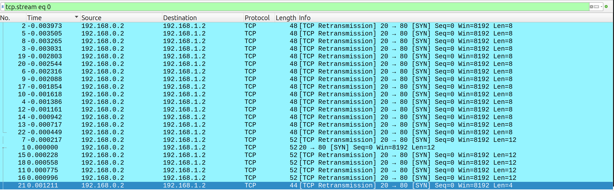

# Ph4nt0m 1ntrud3r

## Challenge

The goal is to uncover the given ```.pcap``` file in Wireshark to find the hidden flag.

## Step 1: Wireshark Analysis

The first part we can look at is the Wireshark packets to recognize any meaningful patterns. I noticed that some of the segment data is of size 8, and some of the others are of size 12. Additionally filtering by time gives the following stream:



## Step 2: Decoding

Notice that each of the segment data from all of the TCP packets are small base 64 encoded strings:

```
echo "ezF0X3c0cw==" | base64 -d

echo "cGljb0NURg==" | base64 -d

echo "YmhfNHJfZA==" | base64 -d

echo "bnRfdGg0dA==" | base64 -d

echo "MTA2NTM4NA==" | base64 -d

echo "XzM0c3lfdA==" | base64 -d

echo "fQ==" | base64 -d
```

if we arrange this message sorted by their timing order in Wireshark, it should reveal the flag in full.