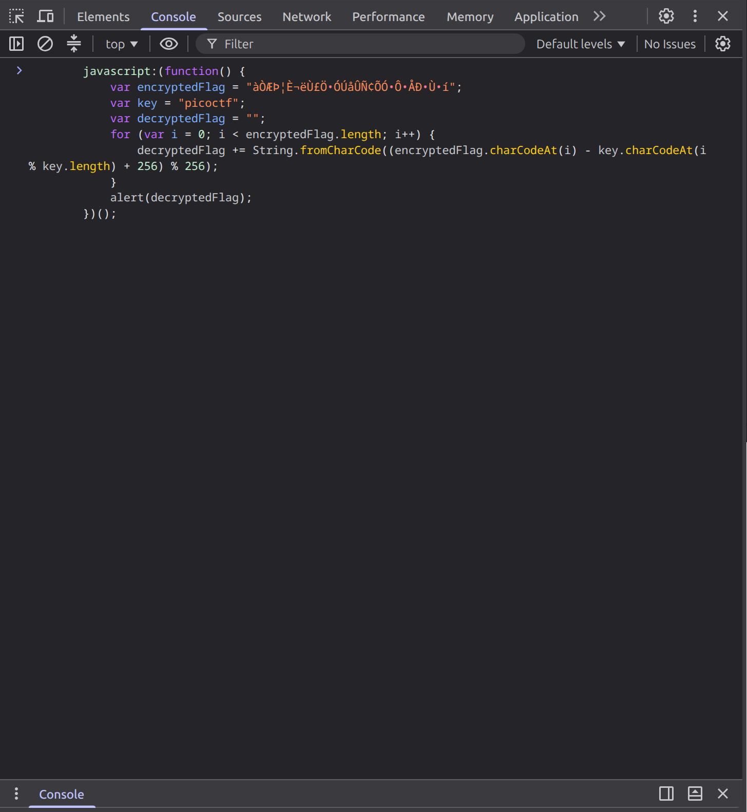

# Bookmarklet

## Challenge

The challenge here is to figure out how to run the given JavaScript code that is shown in the website.

## Step 1: First Solution

The first way to solve this challenge and get the flag is to directly run the code with ```node``` using Node.js:

``` JavaScript
var encryptedFlag = "àÒÆަȬë٣֖ÓÚåÛÑ¢ÕӗԚÅКٖí";
var key = "picoctf";
var decryptedFlag = "";
for (var i = 0; i < encryptedFlag.length; i++) {
    decryptedFlag += String.fromCharCode((encryptedFlag.charCodeAt(i) - key.charCodeAt(i % key.length) + 256) % 256);
}
console.log(decryptedFlag)
```

This will reveal the flag in clear.

## Step 2: Second Solution

You can also copy paste the given code into the browser console, which will also run the code as well:



Then you can hit enter to see the flag in the alert.