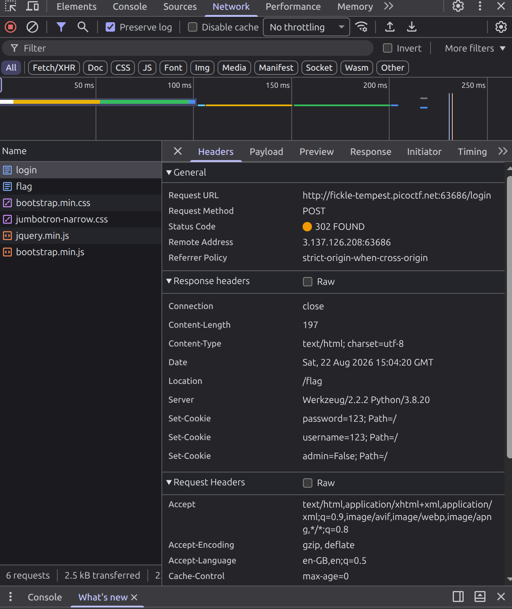

# Logon

## Challenge

The challenge here is to find out the hidden flag within the factory login page.

## Step 1. Testing Logins

When logging in as any username, and any password, the site lets you in and displays a message saying that I can not see the flag.

However, when logging in with ```Joe``` as the username, any attempts at a password seem to fail.

## Step 2. Inspecting Response

Here is a closer look at the response that is given on a successful login:



The strange part is that there is a ```Set-Cookie``` option for the admin value, in which on a succesful login, is set to false.

## Step 3. Modifying the Cookie

In the web console's application area, we can go to storage -> cookies, and then change the value of admin to ```True```. Then, we can reload the page to see the flag in clear.
