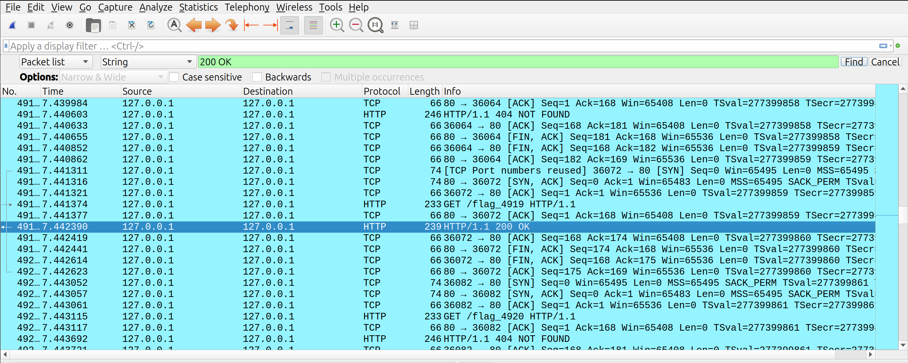

# Bruteforced

## Challenge

Here was the challenge description that was given alongside the ```.pcap``` file:

Help! Our website got bruteforced. Hopefully the attacker did not leak anything.

## Step 1. Inspect Network File

We can inspect the network file using Wireshark. The file itself has a bunch of GET requests to the path ```/flag_i```, where i was a number from 0 to 9999. At first glance, pretty much all the responses to these requests are 404's.

Since the challenge indicates that the website has been brute forced, it is most likely the case that there is a 200 OK somewhere in this file. We can search for this in Wireshark:



## Step 2. Getting the Flag

Based on the 200 OK response and the preceeding request, we can conclude that ```/flag_4919``` is the path that gave this response. We can then use the full given URI to then see the response:

http://ctf.scriptsorcerers.xyz/flag_4919

And accessing the following link should give the flag in clear.

